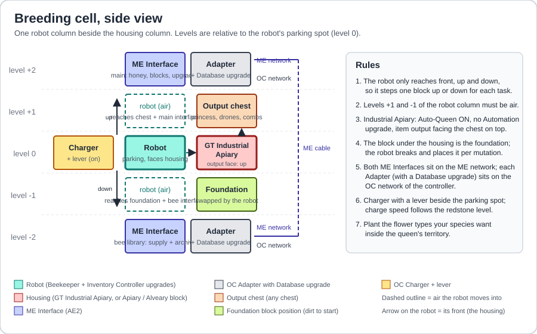
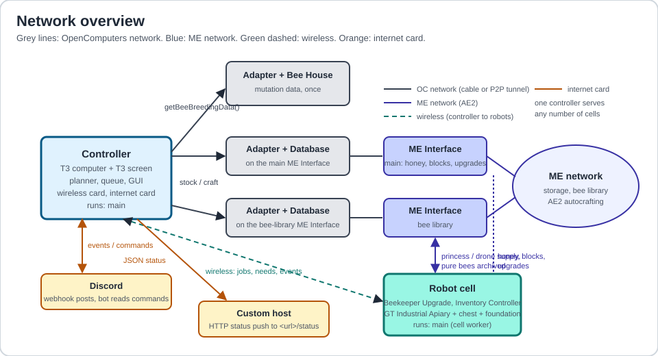

# GTNH-Auto-Bees


Hands-off Forestry bee breeding for GregTech: New Horizons, written in Lua for OpenComputers.
Ask for a species by number, the controller plans the whole mutation chain, robots breed every step in
GT Industrial Apiaries, foundation blocks and climate upgrades get swapped automatically, and pure stock
lands in your ME network. Watch it on a screen or from Discord.

> [!CAUTION]
> This is an alpha. Nothing here has run on a live GTNH server yet. Every OpenComputers and GregTech call
> was taken from the GTNH source, and the breeding logic is covered by a simulator, but expect to confirm
> a few things in game first. See [Status](#status).

## Content

- [Information](#information)
- [Installation](#installation)
- [Setup](#setup)
- [Configuration](#configuration)
- [Development](#development)
- [Status](#status)
- [Credits](#credits)

<a id="information"></a>

## Information

The program has two roles that share one install:

- **Controller** (a computer with a screen): reads the mutation graph out of the game, numbers every species,
  plans chains, keeps a job queue, serves the robots from the ME network, draws the GUI and talks to Discord.
- **Cell** (a robot next to a housing): breeds one job at a time. Fetch a princess and drones from the library,
  set the foundation and climate, run generations, analyze offspring, purify, stockpile, archive.

What it does:

- **Numbered catalog.** Every species gets a stable number on the first survey: `1xxx` Forestry, `2xxx` Extra Bees,
  `3xxx` Magic Bees, `4xxx` GregTech. `breed 4137` is all you type.
- **Whole-chain planning.** The mutation graph comes from `getBeeBreedingData()` through an adapter, so every
  GT, Magic Bees and Extra Bees mutation and its conditions are known. Ask for a deep species and the planner
  schedules the steps in between, skipping anything you already own.
- **Requirements handled by robots.** Foundation blocks are swapped under the housing, Industrial Apiary climate
  upgrades (heater, cooler, humidifier, dryer, Hell emulation) are installed per mutation, offspring are analyzed
  in the robot's own inventory. No Mutatron anywhere.
- **Purity guaranteed.** A job finishes only when the princess is pure-bred and the requested number of pure drones
  is archived. Only analyzed, pure bees ever enter the library.
- **Extras on the way.** `breed 4137 extra 4051=64 4060=32` keeps 64 and 32 drones of two intermediates,
  `all 16` keeps 16 of every intermediate. Intermediates are stockpiled in proportion to how unlikely the next
  mutation is, and a job that runs out of a parent species queues a restock instead of failing.
- **Needs lists.** Per request and for the whole game: which foundation blocks are stocked, craftable, or missing a
  pattern, which climate upgrades, which remote stations.
- **Live everywhere.** A text GUI on the controller, events posted to Discord, commands accepted from Discord,
  optional JSON status pushed to a host of your own.

#### Controls

<kbd>End</kbd> - Closing the program

<kbd>Arrow Up</kbd> / <kbd>Arrow Down</kbd> - Scroll the log

<kbd>Page Up</kbd> / <kbd>Page Down</kbd> - Scroll the queue

Type a command and press <kbd>Enter</kbd>. The same words work in Discord with the `!` prefix.

#### Interface

| Command | Effect |
|---|---|
| `breed 4137` | queue the species with its whole chain, default 8 drones + a princess |
| `breed 4137 keep 32` | 32 drones of the target |
| `breed 4137 extra 4051=64 4060=32` | also stockpile intermediates |
| `breed 4137 all 16` | keep 16 drones of every intermediate |
| `plan 4137` | show the steps, chances and conditions the planner picked |
| `routes 1005 [all]` | every mutation that makes a species, best odds first, marking the one the planner picked |
| `improve 2078 want 2` | breed a better fertility allele onto a species, using a donor from the library |
| `purify 1005 keep 8` | breed a species with itself until its drones stack, holding out rather than settling |
| `needs 4137` | foundation blocks, climate upgrades and stations for that chain, with stock status |
| `find naquadah` | catalog numbers |
| `status`, `queue`, `cells`, `library [text]` | what is happening |
| `cancel j12` / `cancel r3` | stop a job or a whole request |
| `more 1005 keep 64` / `more 1005 keep forever` | just make more of a bee you already have |
| `keep j12 64` / `keep r3 forever` | change what a queued or running job is working towards |
| `scan`, `survey` | rescan the ME library, re-read the mutation graph |
| `pair` | mark each ME interface in turn and ask the robot which one it can reach, then save the answer |
| `diag` | report what the robot can reach above, below and in front of itself |
| `settings` | show connection settings; `settings test` probes them; `settings discord webhook <url>`, `settings discord bot <token> <channel>`, `settings host <url>` change them |

<a id="installation"></a>

## Installation

> [!CAUTION]
> The installer needs an Internet Card. If your server runs Java 8 with old certificates, GitHub downloads can
> fail; then copy the repository onto a floppy and install by hand.

To run the controller you need a computer with:

| Item | Count | Notes |
|---|---|---|
| Computer Case T3 | 1 | T2 works for a single cell; T3 leaves room for more cells and cards |
| CPU T3 | 1 | component limit 16; a Server Rack with Component Buses past about 6 cells |
| Memory T3.5 | 2 | the planner holds the whole mutation graph in RAM |
| Hard Disk T2 or T3 | 1 | OpenOS + data |
| EEPROM (Lua BIOS) | 1 | |
| Graphics Card T3 | 1 | |
| Screen T3 | 1+ | a multiblock screen is nicer; T3 gives the 160x50 text grid |
| Keyboard | 1 | |
| Wireless Network Card T2 | 1 | or wired OC cable to every robot |
| Internet Card | 1 | installer, Discord, host link |
| Disk Drive + OpenOS floppy | 1 | to install the OS once |
| OC Power Converter or Charger power | 1 | any EU/RF source |

Each cell needs a robot assembled in the Electronics Assembler with:

| Item | Count | Notes |
|---|---|---|
| Computer Case T2 (T3 recommended) | 1 | T2 has 3 tier-2 + 3 tier-1 upgrade slots, T3 has 3+3+3 |
| CPU T2 | 1 | |
| Memory T2 | 2 | |
| Hard Disk T1 | 1 | with OpenOS installed |
| EEPROM (Lua BIOS) | 1 | |
| Beekeeper Upgrade | 1 | GTNH-only OpenComputers item, tier 2 slot |
| Inventory Controller Upgrade | 1 | tier 2 slot |
| Inventory Upgrade | 2 | 16 slots each; 32 working slots keeps big generations comfortable |
| Wireless Network Card T2 | 1 | |
| Graphics Card T1 + Screen T1 + Keyboard | 1 each | optional, but you will want to see the robot's console |
| Disk Drive | 1 | optional, to install OpenOS from a floppy directly on the robot |
| Pick (tool slot) | 1 | foundation swaps wear it; a self-repairing or high-durability pick |
| OC Charger + lever | 1 | next to the robot's parking spot; charge speed follows the redstone level |

Install the basic OpenOS on the computer or robot, then run the installer:

```shell
wget -f https://raw.githubusercontent.com/v3rysp3d/GTNH-Auto-Bees/main/installer.lua && installer
```

It downloads the latest release archive into `/home` (falling back to the main branch when no release exists),
keeps an existing `config.lua`, and offers to create the autostart. To start by hand:

```shell
main
```

> [!NOTE]
> On the first start a setup guide runs in the terminal: it lists the components it can see, lets you pick the
> ME Interfaces for the cell, the biome, and Discord and host settings, and saves them to `settings.dat`.
> Run it again any time with `main setup`. On a robot, `main` starts the cell worker instead of the GUI.
> Autostart is a `.shrc` in `/home` containing `main`.

<a id="setup"></a>

## Setup

> [!NOTE]
> For easy copying of addresses, use the Analyzer from the OpenComputers mod. Right-click a component and its
> address is written to chat; click it to copy.

### Data source

#### Components

- Bee House (Forestry): 1
- Adapter: 1

#### Description

The mutation list comes from `getBeeBreedingData()` on a Forestry bee housing. Any Forestry housing works; a cheap
Bee House is enough. Put an Adapter next to it and cable the Adapter to the controller.

> [!CAUTION]
> The GT Industrial Apiary does not expose this component. You need a Forestry housing for the data even if you
> breed in GT machines.

### Breeding cell

#### Components

- GT Industrial Apiary: 1
- Chest: 1
- ME Interface: 2
- Adapter: 2
- Database Upgrade T1: 2
- Robot (see the parts table above): 1
- Charger + lever: 1
- ME cable to both interfaces, OC cable from both Adapters to the controller

#### Layout



The robot parks at level 0 facing the housing and only ever moves straight up or down inside its column. Level +1
gives it the output chest (front) and the main ME Interface (up); level -1 gives it the foundation position
(front) and the bee-library ME Interface (down). Keep both column blocks free.

#### Industrial Apiary settings

- **Auto-Queen ON.** The machine only moves a freshly mated queen back into the slot; the returned princess still
  goes to the chest, which is what the robot expects.
- **No Automation upgrade.** It re-mates the returned princess with whatever drone is left and destroys controlled
  pairing.
- Item output facing the chest on top, speed lock on so installed speed upgrades take effect.
- Recommended upgrades: one speed (speed 5 is 32x at 8,192 EU/t, speed 6 is 64x at 32,768 EU/t), four lifespan,
  light, sky, seal. Climate upgrades are added and removed by the robot per job.
- A dirt block under the machine as the placeholder foundation.
- Flowers of the target species' flower types inside the queen's territory.

#### Climate upgrade pool

Shared by every cell through the ME network, installed per job:

| Item | Count | Notes |
|---|---|---|
| Heater upgrade | 16 | +0.25 temperature each |
| Cooler upgrade | 16 | |
| Humidifier upgrade | 16 | |
| Dryer upgrade | 16 | |
| Hell emulation upgrade | 1 | Hellish temperature without a Nether station |
| Desert / Plains / Jungle / Winter / Ocean emulation | 1 each | only for biome-type conditions |

#### Consumables

| Item | Rate | Source |
|---|---|---|
| Honey Drop | 2 to 5 per generation | centrifuged combs; stocked in the main interface, slot 1 |
| Foundation blocks | 1 per distinct block, reusable | AE2 patterns; the survey writes the full list to `needs_global.txt` |
| Pick durability | 1 per foundation swap | |
| EU | HV plus whatever the speed upgrade adds | |

### Network overview



One controller serves any number of cells. Robots talk to it over the wireless card; the Adapters and ME
Interfaces of every cell are on the controller's OC network and the ME network respectively.

> [!NOTE]
> Remote stations for dimension and biome-ID conditions (an Apiary, Transposer, Adapter, EnderStorage chest pair
> and an OpenComputers P2P tunnel on a quantum-linked ME network) are planned but not supported by the code yet.

### Reading the timestamps

OpenComputers stamps its logs with the in-game clock, which runs 72 times faster than real time. An hour on
screen is fifty real seconds, so a log that looks like it spent an hour on one step spent under a minute.

### A species is available only when you have drones of it

Every mating spends a drone, so the planner counts a species as owned only when the library holds drones of it.
Princesses alone do not make a route usable, which is why a chain can reach for a species you would not expect
while ignoring one you are sure you have. `library <name>` splits the unanalyzed count into drones and
princesses, and `routes` shows the drone count for both parents of every route.

### Making more of what you have

`breed` on a species already in the library queues a stockpile run rather than a mutation, and `more` says the
same thing plainly: `more 1005 keep 64`. With `keep forever` the run has no target and breeds until you cancel
it, which also means it holds that cell, so give it one of its own if you have several. A line at fertility 1
cannot make more of itself and is refused with a pointer at `improve`.

### More than one cell

Each cell declares the temperature and humidity of the biome it stands in. A job that needs a climate goes to
the cell that needs the fewest upgrades to reach it, so a hot mutation lands in the desert cell and a cold one
in the tundra cell rather than wherever happened to be free. A job no cell can reach fails saying so instead of
waiting forever.

### When a queen will not work

A queen that refuses to work is nearly always missing her flowers, the right temperature, the right air, or
somewhere to put what she makes. The robot compares her genome against the cell's biome and the machine's slots
and names the reason: `she wants Hot, the hive is Normal` or `she needs flowersSnow flowers in range`. Climate
it fixes itself with upgrades; the rest reaches you as a warning.

### Better bees win

Between two mates of the same species, the better genetics are chosen: faster production, higher fertility,
working at night, in the rain and underground, and a beneficial effect over a harmful one. Shorter lives count
in favour too, since a shorter cycle means a quicker generation. The weights sit in `genome.traitWeights`.
`purify <species>` breeds a species with itself for that reason alone, holding out until its drones stack
instead of settling for species purity.

### Finished means the drones stack

A bee is done when its drones pile into one stack, which happens only when every chromosome carries the same
allele twice. Species purity is not enough: two Common drones that differ in fertility or speed sit in separate
stacks and pass on unlike offspring. A job counts only drones that breed true towards the number you asked for,
and prefers such a bee as the mate so the line converges. Everything species-pure still reaches the library, it
just does not count. After 60 generations of holding out the job accepts what it has, says so in the log, and
the card notes that the drones do not all stack.

### Lucky bees are kept

A princess carrying the target mated with a parent drone can mutate into the step *after* the one being bred, so
chasing Common turns up the occasional Cultivated. Any bee that is pure of any species goes to the library,
whatever the job was for, and the log says what turned up.

Only hybrids are dropped, and only because a hybrid carries the same label as a pure bee of its active species:
put one in the network and the next fetch may hand it straight back, which costs a cycle to reject. Set
`keepJunk = true` in the cell config to keep them anyway and sort them out yourself.

### Odds are weighed against your stock

Every attempt spends a drone of each parent, so what matters is not the mutation's chance but the chance of a
hit before the drones run out: `1 - (1 - p)^n`. One drone at 30% is a single attempt and usually fails; Forest
and Meadows in quantity at 15% is a near certainty. The planner scores routes that way, so it prefers the one
your library can actually finish, and `routes` prints the arithmetic per route. A line that cannot breed more of
itself is capped at what you hold; a stockpilable one is credited with what it could breed, minus a little for
the time that takes. `stockWeight` in `config.lua` sets how hard this pulls.

### Why it picked those parents

The mutation list is read out of your own game with `getBeeParents`, so it holds whatever your pack defines,
including routes the mods add beyond the Forestry ones. Where several routes make the same bee, the planner
picks by cost: better odds are cheaper, a required foundation block or climate costs extra, and a species you
already own costs nothing to obtain. `routes 1005` prints them all and marks the one it chose.

### A species is never run dry

Every attempt spends a drone of each parent, and a species down to its last one is a species the planner routes
around. `droneFloor` (4 by default) is the level below which a parent is bred back up: a chain tops up what it
is short of before it starts, and a finished job tops up what it spent. A line that cannot multiply is not asked
to, and only one top-up per species is ever in flight.

### Fertility 1 lines cannot be stockpiled

A queen makes as many drones per cycle as her fertility allele, and mating spends one of them, so a line with
fertility 1 breaks even forever: it can never grow its own stock. Such a line is still good for the rest of
breeding, where a princess is given the drones' species and the hybrids are binned, so only stockpiling is
refused. `library` prints the fertility it has seen for each species and marks the ones that cannot stockpile.
Supply those drones from wild hives, or lift the line itself with `improve`.

Fertility is an allele of its own, inherited independently of the species, so a bee that comes out of the hives
at fertility 1 can be lifted. `improve 2078` picks a donor from the library that already has the better allele,
crosses it in, then breeds the species back to pure while keeping the bees that carry the allele twice. A bee
shows both of its alleles once analyzed, so "breeds true" is checked rather than assumed. When it finishes, the
species is stockpilable and the mark is cleared automatically.

### Why it breeds a parent species first

Every attempt at a mutation burns one drone of each parent, and a step with a 15% chance needs about seven
attempts, so a request first queues a stockpile job for any parent the library is short of. That job mates the
species with itself until it has banked enough drones. The `cells` line shows how far along it is, as
`archived 4/11`. If the count sits still for many generations the log says so.

### When drones are bred but never stored

Each generation hands its surplus drones to the ME interface below the robot. If that interface takes nothing,
the drones stay in the robot and the run makes no progress however long it goes. The robot tries every free
slot, says which one it used, and after three failed handovers the job stops with `the bee interface would not
take the drones`. Check that the interface is on the ME network, has a channel, and is not full.

### Honey drops are not optional

Every offspring is analyzed before the robot can tell a mutation from junk, and analysis costs one Honey Drop.
Keep them in the ME network; `library` prints how many are left. Without them a job stops with `analysis needs
Honey Drop` and waits until some arrive, and no bee is ever voided unread.

### When a fetch never arrives

The robot waits at an ME Interface slot that the network is supposed to fill. If the log says a slot stayed
empty, run `pair` on the controller with the robot idle. It stocks two honey drops into each interface in turn
and asks the robot which one it can see, then saves the addresses itself.

Both interfaces being on the same ME network does not make them interchangeable. Each is a separate block with
its own nine slots, and the robot can only reach the one it stands next to, so the addresses have to match the
blocks. `pair` reports which of these is wrong:

| Report | Meaning |
| :---- | :---- |
| `bee interface corrected to ...` | the addresses were swapped and are now saved the right way round |
| `nothing with an inventory below the robot` | the bee interface is missing or the column is off by one block |
| `an inventory sits below the robot but the network never put the marker in it` | no Adapter touches that interface, it is on another ME network, or it has no channel or power |
| `did not answer the probe` | the robot is not running `main` |

`diag` is the smaller version: it reports what the robot can reach above, below and in front without touching
the ME network at all. An ME Interface reports nine slots, the apiary more, air reports none.

`pair` also measures the slot numbering. ME Interface configuration slots count from zero on GTNH while every
inventory read counts from one, so a stocked item lands one slot further along than the robot looks. The
`interfaceSlotOffset` setting holds the difference and defaults to the GTNH value of -1.

<a id="configuration"></a>

## Configuration

General configuration lives in `config.lua`. The setup guide writes its answers to `settings.dat`, which is merged
over the `controller` and `cell` sections at start, so `config.lua` stays a readable template.

#### Controller part

```lua
controller = {
  dataDir = "/home/data",            -- graph.dat, catalog.dat, state.dat, catalog.txt, needs_global.txt
  port = 7311,                       -- wireless / wired port shared with the robots
  ae2 = { network = nil, database = nil }, -- ME network component and Database upgrade, nil = first found
  cells = {
    cell1 = {
      housing = "gt_iapiary",
      mainInterface = "aaaaaaaa-aaaa-aaaa-aaaa-aaaaaaaaaaaa", -- interface above the robot column
      beeInterface = "aaaaaaaa-aaaa-aaaa-aaaa-aaaaaaaaaaaa",  -- interface below the robot column
      base = { temp = 0.8, hum = 0.4 },                       -- biome values where the cell stands
    },
  },
  stations = {},                     -- remote stations you have built, e.g. dimension = { ["End"] = true }
  defaults = { keepDrones = 8, droneSupply = 16, maxGenerations = 400, warnAfter = 60 },
},
```

#### Cell part

Used when `main` runs on a robot. `name` must match a key in `controller.cells`.

```lua
cell = {
  name = "cell1",
  port = 7311,
  housing = "gt_iapiary",            -- gt_iapiary | apiary | magic_apiary | alveary
  slots = { honey = 1, scratch = 2, firstWork = 3 },
  cycleTimeout = 900,                -- seconds a queen may work before the cell is called stuck
  keepUpgrades = { speed = true, lifespan = true }, -- never evicted to make room for climate upgrades
},
```

#### Logger part

Same logger as the reference programs: a Discord webhook for warnings, a file, and the scrolling list on screen.

```lua
logger = loggerLib:newFormConfig({
  name = "Auto Bees",
  timeZone = 0,
  handlers = {
    discordLoggerHandler:newFormConfig({ logLevel = "warning", messageFormat = "{Time:%d.%m.%Y %H:%M:%S} [{LogLevel}]: {Message}", discordWebhookUrl = "" }),
    fileLoggerHandler:newFormConfig({ logLevel = "debug", messageFormat = "{Time:%d.%m.%Y %H:%M:%S} [{LogLevel}]: {Message}", filePath = "logs.log" }),
    scrollListLoggerHandler:newFormConfig({ logLevel = "info", logsListSize = 64 }),
  }
}),
```

#### Discord

A webhook URL is all that is needed. Discord webhooks are one-way, so this is what each level gives you:

| Mode | You provide | You get |
|---|---|---|
| Webhook | a webhook URL | colour-coded event cards (job started, phase reached, done, failed, needs you), a status card that is replaced whenever a job starts or ends, the logger's warnings |
| Bot, no hosting | a bot token and a channel id | all of the above plus `!commands` typed in the channel; the computer polls the channel every few seconds |
| Relay | `relay/bot.py` running on a machine of yours, plus the bot token | a main card with buttons (Status, Queue, Cells, Library, Find, Plan, Needs, Breed, Cancel, Rescan) and a `/bee` slash command; see [relay/README.md](relay/README.md) |

Species are identified by their allele uid, not by name. Where two mods use the same name (Diamond, Ruby, Lapis,
Emerald, Certus, Fluix, Sapphire, Water and a few more) every label carries the mod, for example
`[4060] Diamond (GregTech)` and `[2033] Diamond (Extra Bees)`, `find diamond` lists both, and `breed` asks for the
number when a bare name is shared.

Every card shows the species icon, rendered the way the game does it (outline and body tinted with the species
colours) for all 441 Forestry, Extra Bees, Magic Bees and GregTech species; the icons live in `docs/bees/` and are
regenerated from your modpack's jars with `python tools/bee_images.py`. In bot mode every command works from the
channel: `!find naqua`, `!plan 4137`, `!needs 4137`, `!breed 4137 keep 16`, `!library`, `!status`, `!settings` and the
rest. Species-centred replies come back as embeds with the icon, everything else as a code block.

[How to create a Discord webhook](https://www.svix.com/resources/guides/how-to-make-webhook-discord/). Enter it in
the setup guide or with `settings discord webhook <url>` on the controller; it is stored in `settings.dat`, never in
`config.lua`. For commands, create an application in the Discord developer portal, add a bot, invite it with
*Send Messages* and *Read Message History*, then `settings discord bot <token> <channel id>`.

```lua
discord = {
  enabled = false,
  webhook = "",         -- webhook URL (the guide or `settings discord webhook <url>` fills this)
  token = "",           -- bot token (optional, for commands)
  channel = "",         -- channel id (optional, for commands)
  pollInterval = 5,     -- seconds between command polls (bot mode)
  prefix = "!",
  statusCard = true,    -- keep one status message that is replaced on job start/end
  statusInterval = 0,   -- also refresh the status card every N seconds, 0 = only on events
},
```

The GTNH OpenComputers config allows HTTP with custom headers by default; the setup guide tells you if a server has
turned it off.

#### Custom host

Optional. When `host.url` is set the controller pushes a JSON status document to `<url>/status` every
`host.pushInterval` seconds, so a page of your own can show the queue and the cells. `settings test host` probes
the URL and reports the HTTP code and round trip time; the setup guide offers the same test.

```lua
host = {
  url = "",            -- e.g. http://192.168.1.10:8080
  pushInterval = 30,   -- seconds, 0 = never push
},
```

<a id="development"></a>

## Development

The pure-logic modules run under a real Lua 5.2 on a PC:

```shell
pip install lupa
python test/run_tests.py
```

The suite includes a small Forestry-like genetics simulator that drives the breeding state machine through convert,
mutate, purify and stockpile, and a stress run across many seeds and mutation chances. Nothing in `test/` ships in
the release archive.

Repository layout:

```
main.lua               entry point: controller GUI on a computer, cell worker on a robot
config.lua             configuration template
version.lua            programVersion / configVersion for auto update
installer.lua          downloads the latest release into /home
lib/                   vendored MIT libraries: program, gui, logger, state machine, discovery
src/graph.lua          mutation graph and planner (hyper-edge shortest path)
src/breeder.lua        per-job breeding state machine, hardware independent
src/controller.lua     planner, queue, dispatch, commands, Discord
src/cell.lua           robot worker
src/survey.lua         first run: graph, catalog, condition check, global needs list
src/setup.lua          first-boot guide
src/settings.lua       settings.dat handling
src/conditions.lua     parses "Requires X as a foundation." and friends
src/climate.lua        Forestry climate math for Industrial Apiary upgrades
src/catalog.lua        stable species numbering
src/genome.lua         helpers over OpenComputers bee item stacks
src/ae2.lua            ME network: library scan, crafting, stocking interfaces
src/net.lua            controller <-> robot messages
src/discord.lua        Discord REST over the internet card
src/http.lua           HTTP helper for the internet card
src/connect.lua        connection tests (webhook, bot, host) and the JSON status push
src/needs.lua          needs lists
test/                  Lua 5.2 tests and the breeding simulator
```

<a id="status"></a>

## Status

Alpha. The program has **not run on a live GTNH server yet**. The first things to confirm in game:

- the queen and drone slot numbers of the Industrial Apiary as seen through the Inventory Controller
  (`6` and `7` are configured in `src/housing.lua`)
- the display labels of the Industrial Apiary upgrade items (`upgradeKeys` in `config.lua`)
- the exact text of GregTech's dimension and biome conditions (the survey lists anything it could not parse)

Not built yet: remote dimension and biome stations, robot placement of flowers, harmful-effect handling beyond a
blacklist, one robot serving several housings.

<a id="credits"></a>

## Credits

- `lib/` contains the MIT-licensed program, GUI, logger, state machine and discovery libraries by
  [Navatusein](https://github.com/Navatusein/GTNH-OC-Libraries) (GUI library originally by CAHCAHbl4), vendored
  unchanged. The repository layout, installer flow and release workflow follow the same author's programs.
- Built on the GTNH forks of OpenComputers (Beekeeper Upgrade), Forestry and GT5-Unofficial, with the GTNH wiki's
  bee pages as the reference for game rules.
