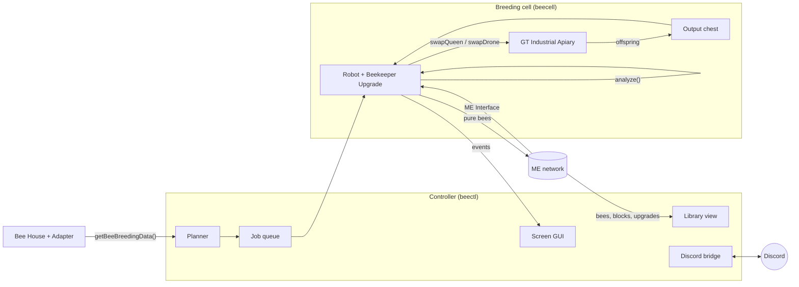

<div align="center">

# GTNH Auto Bees

**Hands-off Forestry bee breeding for GregTech: New Horizons, written in Lua for OpenComputers.**

Ask for a species by number. The controller plans the whole mutation chain, robots breed every step in
GT Industrial Apiaries, foundation blocks and climate upgrades get swapped automatically, and pure stock lands in
your ME network. Watch it live on a screen or from Discord.


</div>

---

## What it does

- **Numbered catalog.** Every species gets a stable number on the first survey (`1xxx` Forestry, `2xxx` Extra Bees,
  `3xxx` Magic Bees, `4xxx` GregTech). `!breed 4137` is all you type.
- **Whole-chain planning.** The mutation graph is read straight out of the game through an adapter, so every GT,
  Magic Bees and Extra Bees mutation and all of its conditions are known. Ask for a deep species and the planner
  schedules the fifty steps in between, skipping anything you already own.
- **Requirements handled by robots.** Foundation blocks are swapped under the housing, Industrial Apiary climate
  upgrades (heater, cooler, humidifier, dryer, Hell emulation) are installed per mutation, and offspring are analyzed in
  the robot's own inventory. Nothing needs a Mutatron.
- **Purity guaranteed.** A job only finishes when the princess is pure-bred and the requested number of pure drones is
  archived. Only analyzed, pure bees ever enter the library.
- **Extras on the way.** `!breed 4137 extra 4051=64 4060=32` keeps 64 and 32 drones of two intermediates,
  `all 16` keeps 16 of every intermediate. Intermediates are also stockpiled automatically in proportion to how
  unlikely the next mutation is, and a job that runs out of a parent species queues a restock instead of failing.
- **Needs lists.** Per request and for the whole game: which foundation blocks are stocked, craftable, or missing a
  pattern; which climate upgrades; which remote stations.
- **Live everywhere.** A text GUI on the controller, events posted to Discord, commands accepted from Discord.

## How it works



The robot runs one **job** at a time: take a princess and drones from the library, set foundation and climate, then
loop generations. Each generation is decided from the princess in hand:

| Phase | Princess state | Mate |
|---|---|---|
| convert | not yet the first parent species | drones of parent A |
| mutate | pure A, no hit yet | drones of parent B |
| purify | carries the target on one allele, or a target drone exists | best target carrier |
| stockpile | pure target | pure target drones, until `keep` drones are archived |

Offspring are prescreened by display name, so honey is only spent on bees that could be interesting, plus the
princess.

## The breeding cell

```
          level +1 :  [Main ME Interface]   <- up: honey, foundation blocks, upgrades; junk goes back
                      [Robot @ +1] -> front: [Output chest]  (on top of the housing)
          level  0 :  [Robot @  0] -> front: [GT Industrial Apiary]      [Charger] behind the robot
          level -1 :  [Robot @ -1] -> front: [Foundation block position]
                      [Bee-library ME Interface]  <- down: princess/drone supply, pure bees archived
```

- The robot parks at level 0 and steps up or down one block for the chest, the interfaces and the foundation.
- Both ME Interfaces are touched by an **Adapter with a Database upgrade** so the controller can stock them.
- Industrial Apiary settings: **Auto-Queen on**, **no Automation upgrade**, item output facing the chest on top.
  Recommended upgrades: one speed, four lifespan, light, sky, seal. Climate upgrades are added per job.
- Robot parts: Beekeeper Upgrade, Inventory Controller Upgrade, wireless network card, a pick in the tool slot.
  Slot 1 holds honey drops, slot 2 is scratch, the rest is working space.
- Somewhere on the network a cheap **Bee House with an Adapter** provides the mutation data. The GT machine does not
  expose it.
- Plant the flower types your target species want inside the housing's territory.

Other housings (Apiary, Magic Apiary, Alveary) are described as drivers in `lib/bb/housing.lua`; the Industrial
Apiary is the one this has been designed around because its built-in acceleration makes a generation take seconds.

## Install

On the controller computer and on each robot (internet card, or copy the repo onto a floppy):

```
wget https://raw.githubusercontent.com/v3rysp3d/GTNH-Auto-Bees/main/install.lua /tmp/install.lua
/tmp/install.lua https://raw.githubusercontent.com/v3rysp3d/GTNH-Auto-Bees/main          # controller
/tmp/install.lua https://raw.githubusercontent.com/v3rysp3d/GTNH-Auto-Bees/main robot    # robot
```

Then:

1. `survey` on the controller. It reads the graph, numbers the species, checks every condition string and writes
   `/home/beebreeder/catalog.txt` and `needs_global.txt`. Report any line under **UNPARSED**.
2. Edit `/etc/beebreeder.cfg`: the ME Interface component addresses for each cell, the cell's biome values, any
   remote stations you have, and Discord if you want it.
3. Edit `/etc/beecell.cfg` on the robot: the cell name and housing type.
4. `beectl` on the controller, `beecell` on the robot. Add `beecell` to `/home/.shrc` so it survives restarts.

## Commands

Same words on the controller's input line and in Discord (prefix `!`):

| Command | Effect |
|---|---|
| `breed 4137` | queue the species with its whole chain, default 8 drones + a princess |
| `breed 4137 keep 32` | 32 drones of the target |
| `breed 4137 extra 4051=64 4060=32` | also stockpile intermediates |
| `breed 4137 all 16` | keep 16 drones of every intermediate |
| `plan 4137` | show the steps, chances and conditions the planner picked |
| `needs 4137` | foundation blocks, climate upgrades and stations for that chain, with stock status |
| `find naquadah` | catalog numbers |
| `status`, `queue`, `cells`, `library [text]` | what is happening |
| `cancel j12` / `cancel r3` | stop a job or a whole request |

## Discord

Create a bot at the Discord developer portal, invite it with *Send Messages* and *Read Message History*, then set
`token`, `channel` and `enabled = true` in `/etc/beebreeder.cfg`. The controller polls the channel every few seconds
for `!commands` and posts job starts, phase changes, hits, completions and anything it needs from you. A webhook URL
works for posting only. The GTNH OpenComputers config allows HTTP with headers by default; the survey tells you if a
server has turned it off.

## Repository layout

```
bin/survey.lua        first run: graph, catalog, condition check, global needs list
bin/beectl.lua        controller: planner, queue, dispatch, GUI, Discord
bin/beecell.lua       robot worker
lib/bb/graph.lua      mutation graph and the planner (hyper-edge shortest path)
lib/bb/breeder.lua    the per-job state machine, hardware-independent
lib/bb/conditions.lua parses "Requires X as a foundation." and friends
lib/bb/climate.lua    Forestry climate math for Industrial Apiary upgrades
lib/bb/catalog.lua    stable species numbering
lib/bb/genome.lua     helpers over OpenComputers bee item stacks
lib/bb/ae2.lua        ME network: library scan, crafting, stocking interfaces
lib/bb/net.lua        controller <-> robot messages
lib/bb/discord.lua    Discord REST over the internet card
lib/bb/needs.lua      needs lists
etc/*.cfg             example configs
test/                 Lua 5.2 tests incl. a Forestry-like breeding simulator
```

## Testing without a server

```
pip install lupa
python test/run_tests.py
```

The suite runs under a real Lua 5.2 and includes a small genetics simulator that drives the breeder through convert,
mutate, purify and stockpile.

## Status and known gaps

This is a first cut and has **not run on a live GTNH server yet**. Everything about the OpenComputers and GregTech
APIs was taken from the GTNH source, but the following are the first things to confirm in game:

- the queen and drone slot numbers of the Industrial Apiary as seen through the Inventory Controller (`6` and `7`
  are configured in `lib/bb/housing.lua`)
- the display labels of the Industrial Apiary upgrade items (`upgradeKeys` in `/etc/beecell.cfg`)
- the exact text of GregTech's dimension and biome conditions (the survey lists anything it could not parse)

Not done yet: remote dimension and biome stations, robot placement of flowers, harmful-effect handling beyond a
blacklist, one robot serving several housings.

## Credits

Built on the GTNH forks of OpenComputers (Beekeeper Upgrade), Forestry and GT5-Unofficial, with the GTNH wiki's bee
pages as the reference for game rules.
